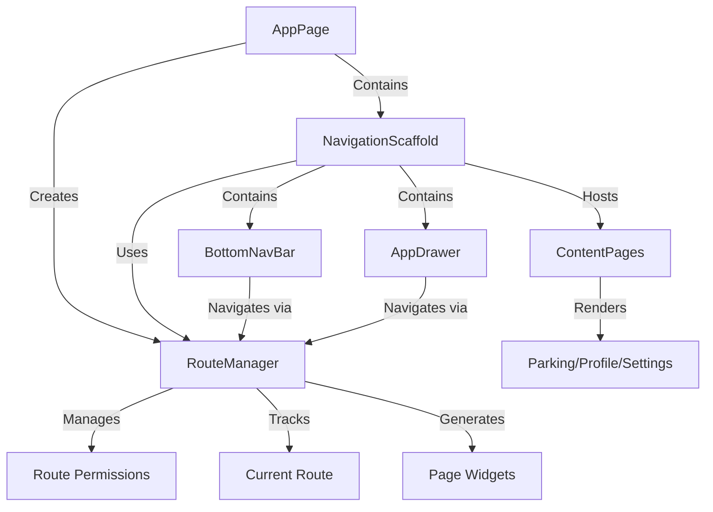

# Active Context

## Current Implementation Status - COMPLETED FEATURES

### ✅ Navigation System - FULLY IMPLEMENTED
- **RouteManager**: Centralized navigation with role-based access control
- **NavigationScaffold**: Persistent navigation structure
- **AppDrawer**: Role-based menu items with dynamic visibility
- **BottomNavBar**: Tab navigation with active state highlighting
- **All main pages connected**: Parking, Profile, Settings, Admin

### ✅ User Management System - FULLY IMPLEMENTED
- **UserManager class**: Complete CRUD operations for users
- **UserPage admin interface**: 
  - List all users with search functionality
  - Edit user details via dialog
  - Delete users with confirmation
  - **CREATE USER FUNCTIONALITY**: Fully implemented with floating action button
- **Validation system**: Centralized ValidationUtils used across all interfaces
- **Role-based access**: Proper separation of admin, student, lecturer, and guest roles
- **Expiry Handling**: Auto-delete expired students/lecturer on login/startup

### ✅ GPS Location System - FULLY IMPLEMENTED
- **LocationService**: Singleton pattern for GPS operations
- **ParkingPage**: Complete GPS display functionality
  - Real-time GPS coordinates display
  - GPS accuracy indicator
  - Current date/time updates every second
  - Manual refresh functionality
  - Error handling for GPS permissions
  - Clean Material Design implementation

### ✅ Authentication System - FULLY IMPLEMENTED
- **Login/Register pages**: Connected with full database integration
- **Role-based authentication**: University ID + phone number (plain text)
- **Session persistence**: SharedPreferences for automatic login
- **AuthManager**: Centralized authentication logic
- **AuthProvider**: State management with ChangeNotifier

### ✅ Profile System - FULLY IMPLEMENTED
- **IdentityCard widget**: Role-based display logic
- **ProfilePage**: Complete user information display
- **Logout functionality**: Properly wired to AuthManager

### ✅ Database Integration - FULLY IMPLEMENTED
- **MySQL via Docker**: Running with pre-populated schema
- **DatabaseManager**: Connection pooling with retry logic
- **Gist configuration**: Secure credential management (HTTPS transport only)
- **Error handling**: Console logging + UI messages
- **Plain text storage**: No encryption implemented
- **Security patterns**: executePrepared/execute distinction documented

### ✅ Component Architecture - FULLY IMPLEMENTED
- **ContentPage Pattern**: All app pages extend ContentPage
- **NavigationScaffold**: Centralized navigation shell
- **AppDrawer**: Role-based drawer navigation
- **BottomNavBar**: Tab navigation with visual states
- **Centralized Navigation**: AppPage manages all navigation

## Architecture Patterns - ESTABLISHED

### FutureBuilder-Only Pattern
- **Enforced**: All async operations use FutureBuilder
- **No mounted checks**: Strictly following Flutter best practices
- **Consistent loading states**: All async widgets show loading indicators
- **Error boundaries**: Every async operation has error handling

### Navigation Architecture

### ContentPage Pattern
- **Requirement**: ALL pages under `@app_page` MUST extend `ContentPage`
- **Location**: `lib/widgets/app/content_page.dart`
- **Usage**: Standardized page structure with title property
- **Examples**:
  - `ParkingPage extends ContentPage`
  - `ProfilePage extends ContentPage`
  - `SettingsPage extends ContentPage`
  - `UserPage extends ContentPage`

### Navigation Widget Architecture
- **NavigationScaffold**: Central shell used by AppPage
- **AppDrawer**: Managed by NavigationScaffold for role-based navigation
- **BottomNavBar**: Managed by NavigationScaffold for tab navigation
- **AppPage**: Single entry point for authenticated users

### Database Security Patterns - DOCUMENTED
- **executePrepared**: **MANDATORY** for all queries with user input
- **execute**: **RESTRICTED** to safe SELECT statements only
- **Security Rules**:
  - Rule 1: User input queries MUST use executePrepared
  - Rule 2: execute only for hardcoded/static SQL
  - Rule 3: All CRUD operations use executePrepared
  - Rule 4: Authentication uses executePrepared
  - Rule 5: Admin operations use executePrepared

## Key Design Decisions - FINALIZED

### Simplified Implementation Approach
- **No model classes**: Direct database interaction with Map<String, dynamic>
- **Pre-populated data**: Parking areas defined in database schema
- **Single QR code**: Admin-uploaded, latest overwrites previous
- **Minimal dependencies**: Only essential packages used
- **Plain text authentication**: University ID + phone number

### Security Model - CLARIFIED
- **Plain text authentication**: University ID + phone number
- **MySQL-level security**: User permissions at database level
- **No encryption**: All data stored in plain text
- **File upload restrictions**: PNG/JPEG/WebP for payment proof
- **Transport security**: HTTPS for Gist configuration only
- **No data backup**: Not implemented in current scope
- **SQL injection prevention**: executePrepared for all user inputs

### Payment System - CLARIFIED
- **Guest rate**: RM1 per hour
- **Currency**: Malaysian Ringgit (RM)
- **QR code**: Single static code, admin update only
- **Payment method**: Bank transfer via displayed QR
- **Proof format**: PNG/JPEG/WebP images
- **Storage**: MySQL BLOB with filename and MIME type
- **Security**: executePrepared for payment-related queries

### Component Usage Requirements - DOCUMENTED
- **ContentPage**: All app pages must extend this base class
- **NavigationScaffold**: Used exclusively by AppPage as root scaffold
- **AppDrawer**: Managed by NavigationScaffold for role-based navigation
- **BottomNavBar**: Managed by NavigationScaffold for tab navigation
- **AppPage**: Single entry point for authenticated users

## Current Focus Areas

### 🔄 IN PROGRESS
1. **Parking Area Validation**: GPS location within pre-defined areas (meters calculation)
2. **Map Integration**: Display current location on OpenStreetMap with flutter_map
3. **QR Payment System**: Guest payment flow with admin approval
4. **Admin Session Review**: Interface for reviewing guest parking sessions

### 📋 NEXT STEPS
1. **Parking Area Detection**: Implement GPS validation against pre-defined areas
   - Distance calculation in meters
   - First matching area wins (no overlap handling)
   - No GPS accuracy threshold
2. **Map Display**: Integrate flutter_map for location visualization
   - OpenStreetMap tiles
   - Current location marker
   - Parking area boundaries
3. **QR Payment Flow**: Complete guest payment system
   - RM1 per hour rate
   - Single QR code display
   - Payment proof upload
4. **Admin Session Review**: Interface for reviewing guest parking sessions
   - Split view: guests vs lecturer/student sessions
   - Map display of session locations
   - Payment proof image viewer
   - Status update: approved/rejected/unverified
5. **User Expiry Handling**: Auto-delete expired users on login/startup
   - Delete user and all associated parking sessions
   - Prompt re-registration for expired users
6. **Security Audit**: Ensure all database queries follow executePrepared/execute rules

## Technical Debt - MINIMAL
- All new code follows FutureBuilder pattern
- No mounted checks in current implementation
- Consistent error handling across all components
- Centralized validation system in place
- Plain text storage (by design, not debt)
- **Component Architecture**: Clean separation with ContentPage pattern
- **Security Patterns**: executePrepared/execute distinction documented

## Clarified Requirements Summary
- **Guest accounts**: Permanent, no expiry handling
- **Admin accounts**: Permanent, no expiry handling
- **Student/lecturer expiry**: Auto-delete on login/startup
- **Payment rate**: RM1 per hour for guests only
- **QR code management**: Single code, admin update only
- **GPS validation**: Meters calculation, first match wins
- **File uploads**: No size limits, no virus scanning
- **Database Security**: executePrepared for user inputs, execute for safe selects

## Security Requirements Added
- **executePrepared**: Must be used for ALL queries with user input
- **execute**: Restricted to safe SELECT statements only
- **Parameter Binding**: Automatic via mysql_client prepared statements
- **Input Validation**: All user inputs validated before database operations
- **SQL Injection Prevention**: Enforced through executePrepared usage