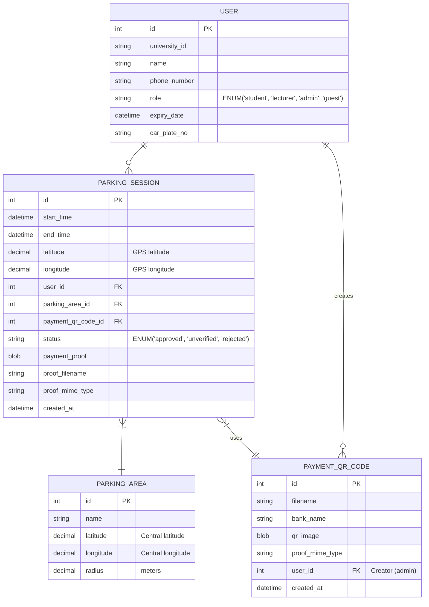

# Plain and Boring Parking Payment App (Android, Flutter)

A Flutter-based Android application for managing parking payments with role-based access control.

## User Roles & Features

### 1. Admin
- **Login Requirements**:
  - University ID (as username)
  - Telephone number (as password in plain text)
- **Permissions**:
  - Full CRUD (Create, Read, Update, Delete) access to all user data
  - Can modify any user's data including other admins
  - Generate Excel reports of parking sessions (FUTURE DEVELOPMENT)
  - Map view of parking sessions via GPS coordinates
  - Parking function (same as lecturer/Student, no payment required)
  - Logout functionality
  - View profile information
  - Upload and manage single static QR code for guest payments (update only, no delete)
  - Review and approve/reject guest parking sessions with proof of payment
- **Account Type**: Permanent (no expiry)

### 2. Student & lecturer
- **Login Requirements**:
  - University ID (as username)
  - Telephone number (as password in plain text)
- **Registration Fields**:
  - University ID
  - Name
  - Telephone number
  - Expiration date
  - Car plate number
- **Features**:
  - Free parking (no payment required)
  - View current parking spot on map
  - Access user profile
  - Use parking function
  - Logout functionality
  - View profile information
  - **Expiry Handling**:
      - Delete user and all associated parking sessions
      - Logout and prompt the user to re-register
      - Trigger on login and app startup
  - Cannot access admin functions

### 3. Guest
- **Login Requirements**:
  - Name
  - Telephone number
- **Registration Fields**:
  - Name
  - Telephone number
  - Car plate number
- **Features**:
  - Paid parking: RM1 per hour (duration selection)
  - View remaining parking time
  - Same parking function as other roles (with payment flow)
  - Must provide proof of payment via uploaded PNG image
  - View profile information
  - Access to parking and settings pages
  - Logout functionality
  - **Account Type**: Permanent (no expiry)
  - **Extension**: Create new parking session when duration expires

## Parking Functionality

### Shared Features (All Roles)
- GPS detection for parking location
- **Parking Area System**: Central coordinates + radius (meters) define valid parking areas
- Real-time calculation to determine if user is within parking area
- **Overlapping Areas**: First matching area is considered valid
- Session submission with area validation
- Map visualization with current location marker (OpenStreetMap)
- Time tracking
- Current date and time display
- **GPS Accuracy**: No minimum threshold required

### Guest-Only Features
- Duration selection (time-based parking)
- **Static QR Code Display**: Single admin-uploaded QR code for RM payment
- **Payment Proof Upload**: PNG image upload for bank transfer proof
- **Approval Flow**: Admin reviews proof before approving parking session
- **Session Expiry**: Overtime warning displayed, new session required for extension

## Parking Area Detection
- **Central Coordinates**: Each parking area has defined center point
- **Radius**: Circular boundary in meters around center point
- **Real-time Calculation**: System calculates distance from current GPS to area center
- **Validation**: Parking only allowed within defined area boundaries
- **Multiple Areas**: System supports multiple parking areas with different centers/radius
- **Distance Formula**: Haversine formula for great-circle distance in meters

## Payment System
- **QR Code**: Single static QR code uploaded by admin (latest upload overwrites)
- **Payment Flow**: Guest views QR → Makes payment → Uploads proof → Admin approves
- **Rate**: RM1 per hour for guest parking
- **Currency**: Malaysian Ringgit (RM)
- **Status Tracking**: Parking sessions have status: approved, unverified, rejected
- **Payment Method**: Bank transfer via displayed QR code

## Database Schema (ERD)

## Security Model
- **Authentication**: Plain text storage (University ID + phone number)
- **Transport Security**: HTTPS for Gist configuration only
- **Database Security**: MySQL user-level permissions
- **Data Storage**: All data unencrypted in database
- **File Upload**: PNG/JPEG/WebP for payment proof (no size limit, no virus scanning)

## Error Handling
- **Logging**: Console output for all errors
- **User Feedback**: Clear error messages and retry options
- **Network Issues**: Manual retry with error messages
- **File Upload**: Error display and retry mechanism
- **GPS Issues**: Manual refresh functionality

## Completed Implementation Details
1. **Environment Configuration**:
   - Gist endpoint configured via environment variables
   - Database connection parameters fetched from private Gist
   - Plain text storage (no encryption)

2. **Database Setup**:
   - MySQL database initialized via Docker
   - Schema loaded from database/uniparkpay_schema.sql
   - Connection tested via scripts in scripts/ folder

3. **Scripts**:
   - scripts/get_gist_data.dart for fetching configuration
   - scripts/test_db.dart for testing database connections

4. **Error Handling**:
   - Console logging for all errors
   - UI error messages for important user-facing errors

## Future Development (Not in Current Scope)
- Excel report generation
- Database backup procedures
- Data retention policies
- Push notifications
- Multiple payment methods
- Advanced GPS accuracy filtering