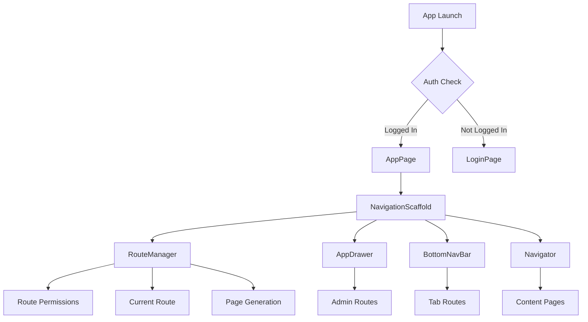

# System Architecture & Patterns

## Core Architecture Decisions

### 1. No Model Classes Pattern
- **Approach**: Direct database interaction using `Map<String, dynamic>`
- **Rationale**: Simplifies data flow, reduces boilerplate
- **Implementation**: All queries return raw database results

### 2. Singleton Service Pattern
- **LocationService**: GPS operations and permissions
- **DatabaseManager**: Database connections and queries
- **AuthManager**: Authentication state and operations
- **UserManager**: User CRUD operations

### 3. FutureBuilder-Only Architecture
- **Rule**: All async operations MUST use FutureBuilder
- **Anti-pattern**: No `if (mounted)` checks allowed
- **Benefits**: Prevents race conditions, consistent loading states

### 4. Centralized Validation
- **ValidationUtils**: Single source for all form validation
- **Used by**: RegisterPage, UserPage (admin)
- **Features**: Role-aware validation, consistent error messages

### 5. ContentPage Pattern - MANDATORY
- **Requirement**: ALL pages under `@app_page` MUST extend `ContentPage`
- **Location**: `lib/widgets/app/content_page.dart`
- **Purpose**: Standardized page structure with consistent title handling
- **Implementation**:
  ```dart
  class MyPage extends ContentPage {
    const MyPage({super.key}) : super(title: 'Page Title');
    
    @override
    State<MyPage> createState() => _MyPageState();
  }
  ```
- **Benefits**: Consistent app bar titles, standardized page lifecycle

### 6. Centralized Navigation Architecture
- **AppPage**: Single entry point for authenticated users (`lib/pages/app/app_page.dart`)
- **NavigationScaffold**: Provides persistent UI shell (`lib/widgets/navigation/navigation_scaffold.dart`)
  - **Usage**: Used exclusively by AppPage, not individual pages
  - **Provides**: AppBar, Drawer, BottomNavBar, and content area
  - **Integration**: Works with RouteManager for consistent navigation

### 7. Database Security Patterns - CRITICAL

#### SQL Injection Prevention Requirements
- **executePrepared**: **MUST** be used for ALL queries with user input
  - **Location**: `lib/database/db_manager.dart:49-60`
  - **Usage**: `DatabaseManager().executePrepared(sql, [param1, param2, ...])`
  - **Purpose**: Parameterized queries prevent SQL injection
  - **Required for**: All INSERT, UPDATE, DELETE operations with user data

- **execute**: **MUST** be used only for safe SELECT statements
  - **Location**: `lib/database/db_manager.dart:37-47`
  - **Usage**: `DatabaseManager().execute(sql, params)` 
  - **Purpose**: Safe for read-only queries with no user input
  - **Allowed for**: Static SELECT queries, system queries without parameters

#### Security Enforcement Rules
- **Rule 1**: Any query containing user input MUST use `executePrepared`
- **Rule 2**: `execute` is only for hardcoded/static SQL statements
- **Rule 3**: User registration, login, profile updates MUST use `executePrepared`
- **Rule 4**: Admin user management operations MUST use `executePrepared`

#### Example Usage Patterns
```dart
// ✅ CORRECT - User input with executePrepared
await DatabaseManager().executePrepared(
  'INSERT INTO USER (university_id, name, phone_number) VALUES (?, ?, ?)',
  [userId, name, phoneNumber]
);

// ✅ CORRECT - Safe SELECT with execute
await DatabaseManager().execute(
  'SELECT * FROM PARKING_AREA WHERE active = 1'
);

// ❌ INCORRECT - User input with execute
await DatabaseManager().execute(
  'SELECT * FROM USER WHERE university_id = $userId'  // SQL injection risk
);
```

## Navigation Architecture

### App Routing Logic - COMPLETE IMPLEMENTATION

#### 1. Main App Entry Point (lib/main.dart)
- **Initial Route Logic**: 
  - Checks `AuthProvider.isLoggedIn` to determine initial route
  - If logged in: `AppPage(title: 'UniParkPay')` (main app)
  - If not logged in: `LoginPage()` (authentication flow)
- **Route Registration**: 
  - `/register` route mapped to `RegisterPage()`
  - `onUnknownRoute` handler for 404-style routing

#### 2. AppPage Routing Setup (lib/pages/app/app_page.dart)
- **Purpose**: Main application container after authentication
- **RouteManager Initialization**: 
  - Creates `RouteManager` with `AuthProvider` and `NavigatorKey`
  - Passes `RouteManager` to `NavigationScaffold`
- **Navigation State**: Single `GlobalKey<NavigatorState>` for all navigation

#### 3. NavigationScaffold Architecture (lib/widgets/navigation/navigation_scaffold.dart)
- **Persistent Navigation**: Single scaffold for entire app
- **Components**:
  - **AppBar**: Dynamic title from `RouteManager.currentPage.title`
  - **Drawer**: `AppDrawer` with role-based menu items
  - **Body**: `Navigator` widget with `RouteManager.onGenerateRoute`
  - **BottomNavBar**: `BottomNavBar` with tab navigation
- **State Management**: `ValueListenableBuilder` for route changes

#### 4. RouteManager - Central Navigation Controller (lib/app/route_manager.dart)
- **Core Responsibilities**:
  - Route generation via `onGenerateRoute`
  - Current route tracking with `ValueNotifier<String>`
  - Role-based route permissions
  - Navigation state management

- **Route Definitions**:
  ```dart
  static const Map<String, ContentPage> routeMap = {
    '/parking': ParkingPage(),
    '/profile': ProfilePage(),
    '/settings': SettingsPage(),
    '/admin/users': UserPage(),
  };
  ```

- **Access Control**:
  ```dart
  final routePermissions = {
    '/dashboard': [UserRole.admin, UserRole.lecturer, UserRole.student],
    '/parking': UserRole.values,
    '/admin/users': [UserRole.admin],
    '/profile': UserRole.values,
    '/settings': UserRole.values,
  };
  ```

- **Navigation Methods**:
  - `canAccess(String? route)`: Checks role-based permissions
  - `navigateTo(String route)`: Safe navigation with permission check
  - `onGenerateRoute`: Route factory with fallback to default

#### 5. AppDrawer Navigation (lib/widgets/navigation/app_drawer.dart)
- **Role-Based Visibility**: Only shows admin routes to admin users
- **Route Tracking**: Highlights current route with selection state
- **Navigation Flow**: 
  - Uses `RouteManager.navigateTo()` for consistent navigation
  - Closes drawer after navigation with `Navigator.pop(context)`

#### 6. BottomNavBar Navigation (lib/widgets/navigation/bottom_nav_bar.dart)
- **Tab Navigation**: 
  - Index 0: `/parking` route
  - Index 1: `/profile` route
- **Visual State**: 
  - Dynamic colors based on current route
  - Active tab highlighting with `selectedColor`
- **Navigation Logic**: Direct `RouteManager.navigateTo()` calls

### Navigation Flow Architecture


### App Page Structure - ENFORCED
- **Location**: All app pages MUST be in `lib/pages/app/`
- **ContentPage Requirement**: Every page MUST extend `ContentPage`
- **Navigation**: All pages rendered within NavigationScaffold via RouteManager
- **Examples**:
  - `lib/pages/app/parking_page.dart` - Parking functionality
  - `lib/pages/app/profile_page.dart` - User profile
  - `lib/pages/app/settings_page.dart` - App settings
  - `lib/pages/app/admin/user_page.dart` - Admin user management

### Navigation Widgets - USAGE PATTERN
- **AppDrawer**: `lib/widgets/navigation/app_drawer.dart`
  - **Role-based**: Shows admin routes only to admin users
  - **Location**: Left-side drawer navigation
  - **Integration**: Used by NavigationScaffold
  
- **BottomNavBar**: `lib/widgets/navigation/bottom_nav_bar.dart`
  - **Tabs**: Parking (index 0) and Profile (index 1)
  - **Visual**: Dynamic colors based on current route
  - **Integration**: Used by NavigationScaffold

### User Management Architecture

### UserManager Class
- **CRUD Operations**: Complete user lifecycle management
- **Validation**: Centralized input validation
- **Role Handling**: Automatic role detection (student/lecturer/admin)
- **Database Integration**: Direct SQL operations
- **Expiry Handling**: Automatic deletion of expired users on login/startup

### IdentityCard Pattern
- **Factory Constructor**: `IdentityCard.fromAuthProvider()`
- **Role-based Display**: Shows relevant fields per user type
- **Reusable Component**: Used across ProfilePage and other contexts

## Database Patterns

### Configuration Management
- **Gist-based**: Secure credential storage (HTTPS only)
- **Environment Variables**: Initial configuration only
- **Auto-retry**: Connection failures trigger config refresh
- **Security Note**: Only transport security, data stored plain text

### Query Pattern
- **Parameterized Queries**: SQL injection protection via executePrepared
- **Connection Pooling**: MySQLConnectionPool for performance
- **Error Handling**: Console logging + user-friendly messages

### Security Requirements - ENFORCED
- **executePrepared**: **REQUIRED** for all queries with user input
- **execute**: **ALLOWED** only for safe SELECT statements without parameters
- **Validation**: All user inputs validated before database operations
- **Escaping**: Automatic parameter escaping via mysql_client

## Security Model

### Authentication
- **Plain Text**: University ID + phone number
- **No Hashing**: Phone numbers used as passwords
- **Session Persistence**: SharedPreferences for auto-login
- **Role-based Access**: Route-level permission checking
- **Transport Security**: HTTPS for Gist configuration only

### Data Storage
- **Plain Text Storage**: All data unencrypted in database
- **Database Security**: MySQL user-level permissions
- **File Upload**: PNG/JPEG/WebP for payment proof
- **No API Tokens**: Direct database connections
- **File Storage**: MySQL BLOB for payment proof images

### SQL Injection Prevention
- **executePrepared**: **MANDATORY** for user input queries
- **execute**: **RESTRICTED** to safe, static queries only
- **Parameter Binding**: Automatic via mysql_client prepared statements
- **Input Validation**: Centralized validation before database operations

## Error Handling Standards

### Logging
- **Console Output**: All errors logged for debugging
- **SQL States**: Database errors include context
- **Network Errors**: Timeout and connection details

### User Feedback
- **Form Validation**: Clear, consistent error messages
- **Loading States**: All async operations show progress
- **Error Boundaries**: Widget-level error handling
- **Success Confirmations**: Action completion feedback

## Parking System Architecture

### GPS Validation Logic
- **Distance Calculation**: Haversine formula in meters
- **Area Matching**: First matching area wins (no overlapping handling)
- **Radius Units**: Meters for all calculations
- **GPS Accuracy**: No minimum accuracy threshold

### Coordinate Storage
- **Format**: Separate latitude and longitude columns (DECIMAL 10,8 / 11,8)
- **Rationale**: MySQL client compatibility (POINT datatype not supported)
- **Precision**: 8 decimal places for sub-meter accuracy

### Payment System
- **Currency**: Malaysian Ringgit (RM)
- **Rate**: RM1 per hour for guests
- **QR Code**: Single static QR code (latest admin upload)
- **Payment Method**: Bank transfer via displayed QR code
- **Proof Storage**: PNG/JPEG/WebP in MySQL BLOB

### Session Management
- **Status Flow**: unverified → approved/rejected (admin only)
- **Expiry Handling**: Overtime warning displayed, new session required
- **Data Cleanup**: User deletion cascades to parking sessions
- **Extension**: Manual new session creation required

## Current Implementation Status

### ✅ COMPLETED PATTERNS
- FutureBuilder-only async operations
- Singleton service instances
- Centralized validation system
- Role-based navigation
- Consistent error handling
- Reusable UI components
- Complete routing architecture with role-based access control
- ContentPage pattern enforcement
- Centralized navigation through AppPage
- Database security patterns with executePrepared/execute distinction

### 🔄 PENDING IMPLEMENTATIONS
- Parking area GPS validation (meters calculation)
- Map integration with flutter_map (OpenStreetMap)
- QR payment system (RM1/hour, single QR)
- User expiry handling (auto-delete on login/startup)
- Admin session review interface (split view: guests vs lecturer/student)